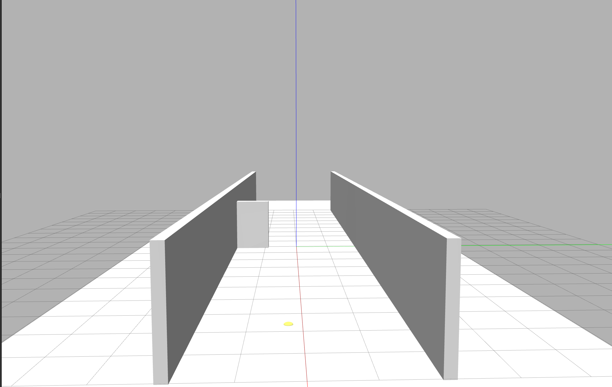
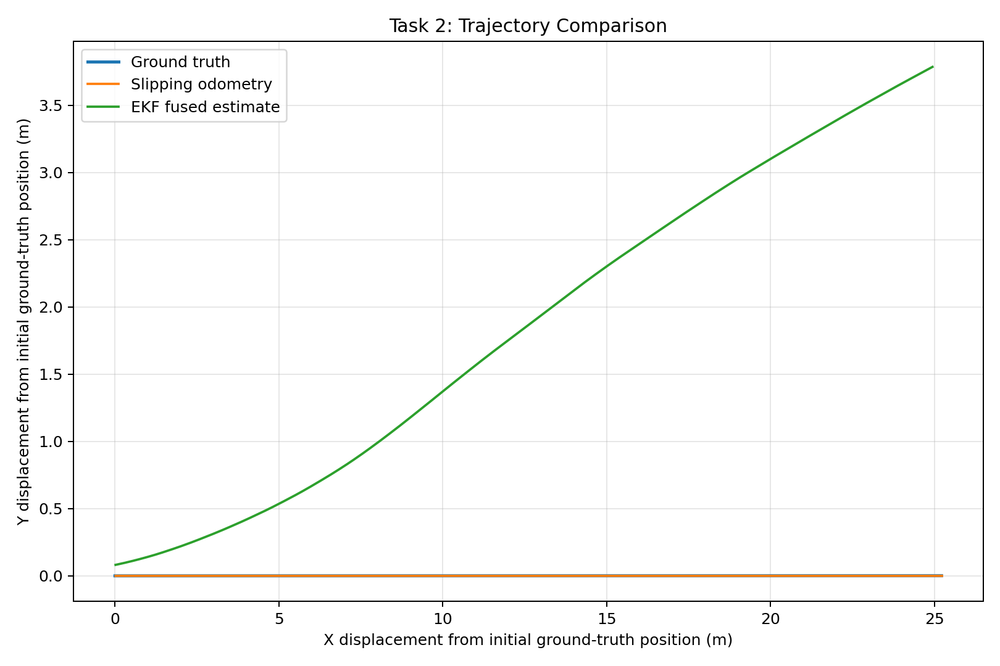
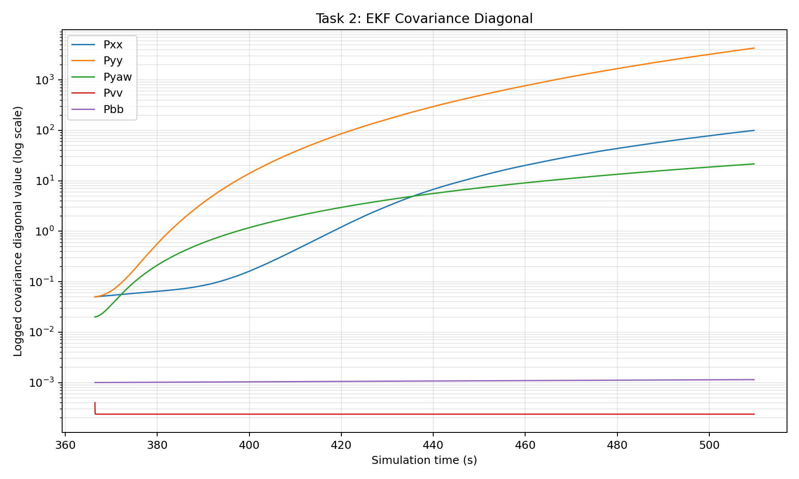
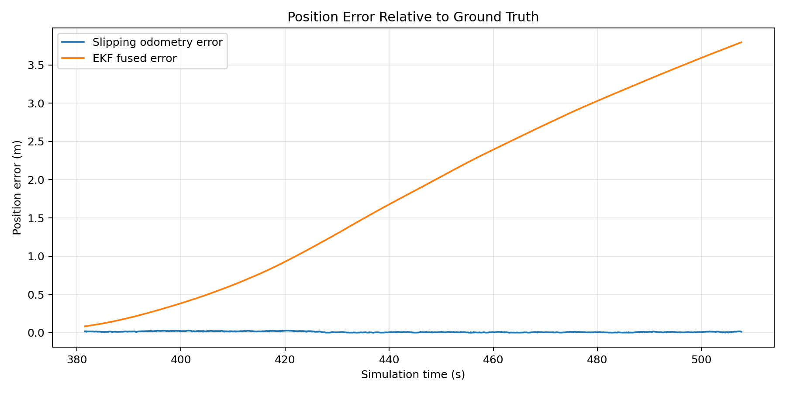
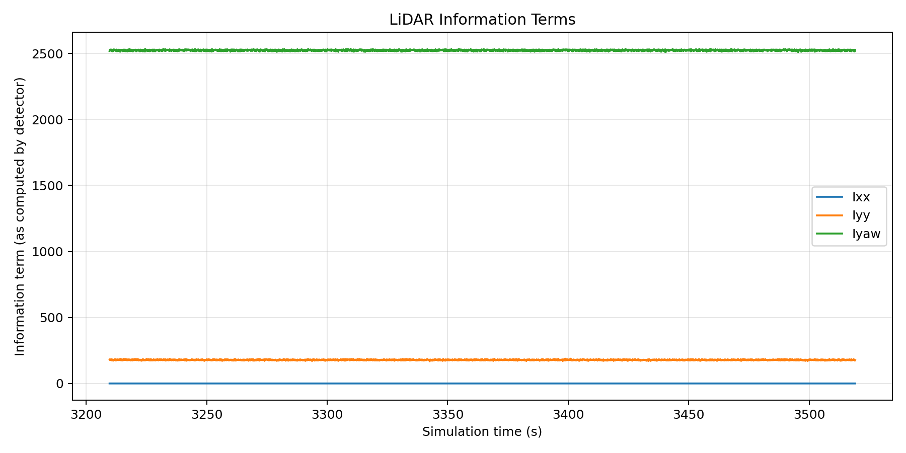
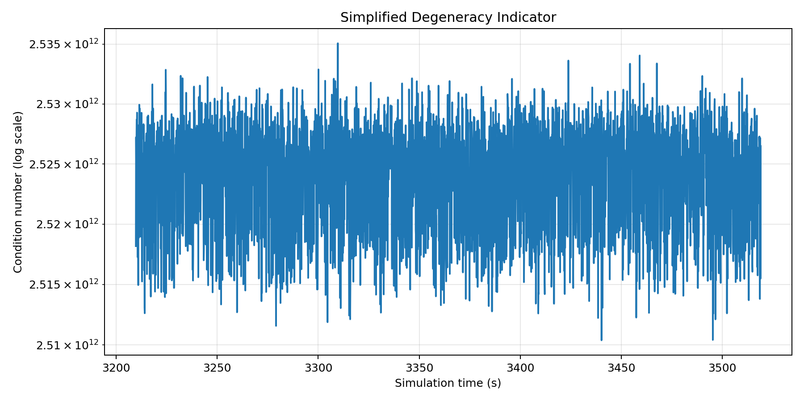
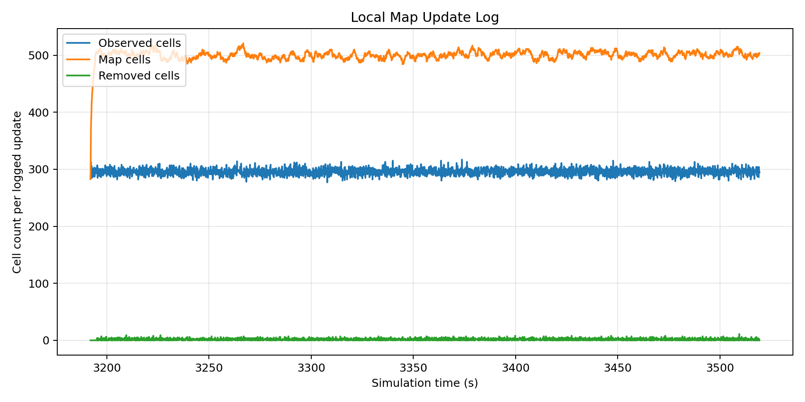

# Robust Localization and Lifelong Mapping Under Sensor Degradation

A ROS 2 + Gazebo simulation study of mobile-robot localization and mapping
under **wheel slip, IMU degradation, dynamic obstacles, and LiDAR degeneracy**.

---

## Problem Statement & Motivation

Mobile robots operating in real-world environments must estimate their motion
and maintain a map using sensors that are inherently imperfect.

In practical deployments, several sources of uncertainty can occur
simultaneously:

- **Wheel slip:** low-friction or dusty surfaces can cause wheel odometry to
  underestimate or misrepresent the robot's actual motion.
- **IMU degradation:** vibration and sensor imperfections can introduce
  measurement noise and slowly varying gyroscope bias.
- **Dynamic environments:** objects that were previously mapped may move,
  making previously valid map information obsolete.
- **Geometric degeneracy:** long, featureless structures such as corridors
  may provide insufficient geometric information to constrain the robot's
  motion along certain directions.

These problems are particularly important for robots operating in environments
such as construction sites, warehouses, tunnels, industrial facilities, and
other partially structured or changing environments.

### Project Objective

The objective of this project is to develop a controlled simulation in which
these failure modes can be introduced and studied systematically.

The robot must:

1. operate in a **featureless corridor with a dynamically moving wall**,
2. estimate its state despite **degraded odometry and IMU measurements**,
3. maintain an updated local map as the environment changes, and
4. detect when the LiDAR geometry becomes **insufficient for reliable
   localization**.

The overall problem can therefore be viewed as:

```text
       Real / Changing Environment
                    │
                    ▼
          Imperfect Sensor Data
          ┌─────────┴─────────┐
          │                   │
       Odometry              IMU
       + Slip            + Bias/Noise
          │                   │
          └─────────┬─────────┘
                    ▼
             State Estimation
                  (EKF)
                    │
                    ▼
             Robot State
             [X, Y, Yaw]
                    │
                    ▼
                 LiDAR
                    │
          ┌─────────┴─────────┐
          ▼                   ▼
     Map Updating       Degeneracy
                         Detection
          │                   │
          ▼                   ▼
     Consistent Map      Localization
                           Warning
```


# Task 1 — Dynamic and Degenerate Simulation Environment

The first stage of the project is to construct a controlled simulation
environment that exposes a mobile robot to both **structural geometric
degeneracy** and a **changing environment**.

The environment is implemented in **Gazebo Classic** using ROS 2 Humble.

## 1.1 Corridor Environment

A 20-meter straight corridor is constructed with long, flat and
featureless walls.

The lack of distinctive geometric features intentionally creates a
challenging LiDAR localization scenario. A robot moving along the corridor
can observe very similar wall geometry over a large portion of its trajectory,
providing weak constraints on motion along the corridor axis.

```text
                 20 m Corridor
    ┌─────────────────────────────────────────┐
    │                                         │
    │                                         │
    │                  │                      │
    │                  │ Moving               │
    │                  │ Wall                 │
    │                  │                      │
    │        🤖  ────────────────→            │
    │                                         │
    │                                         │
    └─────────────────────────────────────────┘
```

The wall changes its lateral position every 15 seconds:

```text
t = 0 s       Initial position
t = 15 s      +1.5 m
t = 30 s      -1.5 m
t = 45 s      +1.5 m
```
This provides the dynamic environment used later for map updating and
ghost-obstacle removal.

### Sensors

| Sensor | Configuration |
|---|---|
| 3D LiDAR | 16 channels |
| IMU | 6-axis |
| Odometry | Differential-drive |

The main ROS 2 topics are:

```text
/odom      → robot odometry
/imu       → IMU measurements
/points    → 16-channel 3D LiDAR point cloud
```

Run
Start Gazebo:
```bash
conda deactivate
source /opt/ros/humble/setup.bash
source ~/Documents/pace/install/setup.bash
export GAZEBO_MODEL_PATH=$HOME/Documents/pace/install/task1_simulation/share/task1_simulation/models
export GAZEBO_PLUGIN_PATH=$HOME/Documents/pace/install/moving_wall_plugin/lib

gzserver --verbose ~/Documents/pace/src/task1_simulation/worlds/corridor.world \
-s libgazebo_ros_init.so -s libgazebo_ros_factory.so
```

In another terminal, spawn the robot:
```bash
conda deactivate
source /opt/ros/humble/setup.bash
source ~/Documents/pace/install/setup.bash

ros2 run gazebo_ros spawn_entity.py \
-entity burger3d \
-file ~/Documents/pace/install/task1_simulation/share/task1_simulation/models/turtlebot3_burger_3d_lidar/model.sdf \
-x -8.0 -y 0.0 -z 0.05
```

Result
The simulation provides the dynamic corridor environment and publishes the
sensor streams required by the localization and mapping pipeline.

<p align="center">
  
  <br />
  <em>Figure 1. Gazebo Classic corridor environment showing the laterally moving wall.</em>
</p>

The next stage introduces controlled degradation into the odometry and IMU
measurements and uses an EKF to estimate the robot state.


# Task 2 — Sensor Degradation and EKF State Estimation

Task 2 introduces realistic sensor degradation and uses an Extended Kalman
Filter (EKF) to estimate the robot state from the imperfect measurements.

The assignment models two main effects:

1. **Wheel slip:** odometry underestimates forward velocity in the slipping
   region.
2. **IMU degradation:** gyro measurements contain white noise and a slowly
   drifting bias.

### Sensor Degradation

The recorded velocity is modeled as:

$$
v_{recorded}(t) = s(t)v_{true}(t) + w_v(t)
$$

where

$$
s(t)=
\begin{cases}
0.70, & 10 \leq Position_X \leq 15 \\
1.00, & \text{otherwise}
\end{cases}
$$

The gyro measurement follows:

$$
\omega_{measured}(t)
=
\omega_{true}(t) + b(t) + \eta_g(t)
$$

with a slowly varying bias:

$$
\dot{b}(t)=\eta_b(t)
$$

### EKF State Estimation

The EKF estimates the robot state:

$$
\mathbf{x} =
[x,\;y,\;\theta,\;v,\;b]^T
$$

where:

- $x,y$ — robot position
- $\theta$ — heading
- $v$ — forward velocity
- $b$ — gyro bias

The EKF propagates the state using the motion model and IMU measurement,
then updates the velocity estimate using the degraded odometry measurement.

Selected diagonal entries of the EKF covariance are recorded over time to
quantify the estimated state uncertainty.

### Covariance Matrix

The EKF covariance tracks the uncertainty of the estimated state
$[x,y,\theta,v,b]^T$.

For example:

- $P_{xx}$ — uncertainty in robot $x$ position
- $P_{yy}$ — uncertainty in robot $y$ position
- $P_{\theta\theta}$ — uncertainty in heading
- $P_{vv}$ — uncertainty in velocity
- $P_{bb}$ — uncertainty in gyro bias

A growing covariance means the EKF is becoming less certain about the
corresponding state estimate.

The recorded covariance is available in:

```text
data/ekf_covariance.csv
```

### LiDAR Information Matrix
The Information Matrix describes how much geometric information the current
LiDAR scan provides about the robot pose $x,y,\theta^T$.
In the corridor:
- Low information in $x$ → the scan provides weak constraint along the
  corridor axis.
- High information in $y$ → the corridor walls strongly constrain lateral
  motion.
- Low information in a direction → potential localization degeneracy in that
  direction.
- A very small minimum eigenvalue indicates that the scan is nearly
  degenerate.
The resulting information values, eigenvalues, and degeneracy condition are
recorded in:

```text
data/scan_degeneracy.csv
```

### Run

Start the sensor degradation node:

```bash
conda deactivate
source /opt/ros/humble/setup.bash
source ~/Documents/pace/install/setup.bash

ros2 run noise_injection noise_node
```

Start the EKF:
```bash
conda deactivate
source /opt/ros/humble/setup.bash
source ~/Documents/pace/install/setup.bash

ros2 run ekf_localization ekf_node
```

Start trajectory logging:
```bash
conda deactivate
source /opt/ros/humble/setup.bash
source ~/Documents/pace/install/setup.bash

ros2 run trajectory_logger logger_node
```

### Results

The EKF output is compared against ground-truth and degraded odometry.

<p align="center">
  
  <br />
  <em>Ground-truth vs. slipping odometry vs. fused EKF trajectory.</em>
</p>

The logged EKF covariance diagonal entries are shown below.

<p align="center">
  
  <br />
  <em>Evolution of the logged EKF covariance diagonal entries on a logarithmic scale.</em>
</p>


The trajectory comparison is saved to:
```text
data/trajectory_comparison.csv
```
The fused state is intended to provide the localization estimate for the
mapping and degeneracy analysis in Task 3. The recorded covariance indicates
growing uncertainty in some state variables during the current run.


# Task 3 — Lifelong Map Updates and Localization Diagnostics

Task 3 handles environmental changes and detects when LiDAR geometry becomes
insufficient for reliable localization.

### Map Update

A time-decayed local map is maintained from the incoming LiDAR point cloud.

When previously observed geometry is no longer observed for a sufficient
period, the corresponding map cells are removed. This prevents the old
position of the moving wall from remaining as a ghost obstacle.

```text
LiDAR observations
        ↓
Local map update
        ↓
Stale cells detected
        ↓
Old geometry removed
        ↓
Updated local map
```

The map update log is saved to:

```text
data/map_update.csv
```

### Localization Degeneracy Warning

A simplified LiDAR information-based indicator is evaluated from the incoming
point cloud to identify potentially weakly constrained directions.

The current simplified information-based detector flags all recorded scans
as degenerate in this run. It logs `LOCALIZATION_DEGENERACY_WARNING` once.
This indicates that the current threshold or information model needs further
validation; it does not establish that every scan is independently degenerate.

This warning indicates that the simplified indicator has detected a
potentially degenerate scan geometry. It is a diagnostic approximation,
not a full ICP scan-matching result.
The degeneracy log is saved to:
data/scan_degeneracy.csv

### Results

The following figures summarize the recorded position error, simplified
LiDAR information indicator, degeneracy condition number, and map-update
statistics.

<p align="center">
  
  <br />
  <em>Position error of slipping odometry and the EKF fused estimate relative to ground truth.</em>
</p>

<p align="center">
  
  <br />
  <em>Information terms computed by the simplified LiDAR degeneracy detector.</em>
</p>

<p align="center">
  
  <br />
  <em>Condition-number indicator computed from the simplified information model.</em>
</p>

<p align="center">
  
  <br />
  <em>Observed, retained, and removed map-cell counts recorded during map updates.</em>
</p>

Run

Start the map update node:
```bash
conda deactivate
source /opt/ros/humble/setup.bash
source ~/Documents/pace/install/setup.bash

ros2 run map_update map_node
```

Start LiDAR degeneracy analysis:
```bash
conda deactivate
source /opt/ros/humble/setup.bash
source ~/Documents/pace/install/setup.bash

ros2 run scan_degeneracy scan_info_node
```

Move the robot through the corridor:
```bash
ros2 topic pub --rate 5 /cmd_vel geometry_msgs/msg/Twist \
"{linear: {x: 0.2}, angular: {z: 0.0}}"
```

Results
The system:
- removes stale map cells after environmental changes,
- updates the local map using current LiDAR observations, and
- reports LOCALIZATION_DEGENERACY_WARNING when the scan geometry becomes
  poorly constrained.